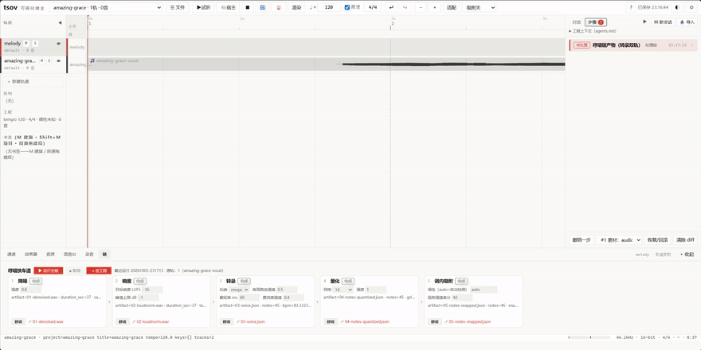
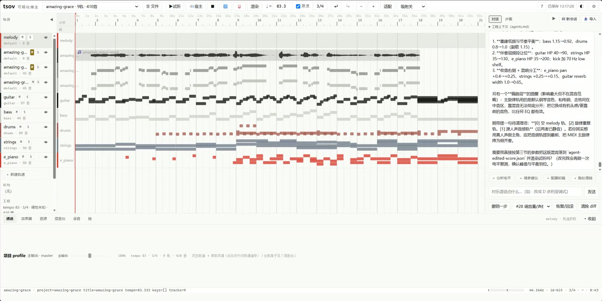
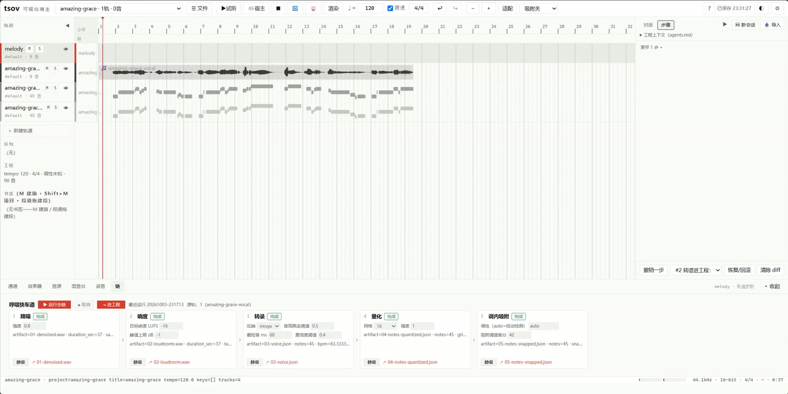
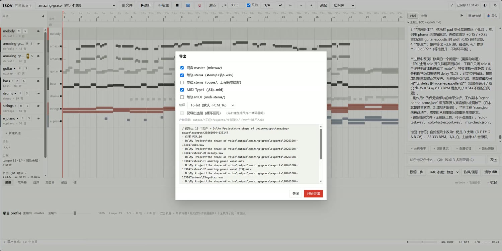
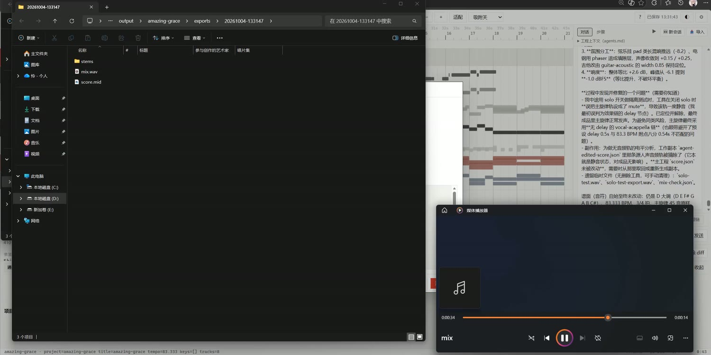

# tsov — the shape of voice

**简体中文 | [English](README.md)**

> **哼一段，拿到一首能继续编辑的歌。**
> tsov 是一个本地优先的 AI 原生音乐工作台：对着它哼一段旋律，一个 LLM agent 会和你一起在真实的音乐工程上干活——转录、编配、混音、导出——全部经由同一条命令层，每一步都可见、可撤销、可回退。



**演示视频（2:14）**——中英两版都在 [v0.1.0 Release](https://github.com/luolianst/tsov/releases/latest) 附件里（B站版发布后补链接）。演示覆盖完整闭环：导入哼唱录音 → 转谱 → 采纳 MIDI → 四轮对话（对齐编曲 / 配器 / 混音指导 / 混音导出）→ 试听成品。

| 工作台与对话 | 哼唱快车道 | 导出 | 试听成品 |
|---|---|---|---|
|  |  |  |  |

## 它能做什么

把「我会哼，但我写不出来」变成一份真实、可继续编辑的音乐工程：

| 步骤 | 发生了什么 |
|---|---|
| 🎤 **哼** | 录一段随手哼唱导入（或任何音频 / MIDI 文件）。 |
| 🎼 **转录** | 一键跑「**哼唱快车道**」：降噪 → 响度 → 转录（哼唱 RMVPE / 成品人声 GAME）→ 量化 → 调内吸附。每步产物留档；「采纳」后以可编辑 MIDI 轨落进工程。 |
| 💬 **对话** | 跟 agent 说话来改工程：「先把速度设成它的自然速度，做一版民谣编曲」「分析这段旋律并配器到完整的程度」「进行混音指导」「开始混音并导出」。每一轮都会落成可审查的 diff 和动作卡——随时撤销。 |
| 🎛 **改** | 浏览器里的完整工作台：钢琴卷帘写谱（总谱 ↔ 单轨）、多轨编配、总线与效果链（pedalboard）、自动化车道、电平表、非破坏性音频剪辑、带监听的录音。 |
| 📦 **出** | 混音 master / 分轨 stems / 总线 / MIDI；16/24/32 位深；选段导出；产物落进带时间戳的 `exports/` 文件夹。 |

整条闭环**本地**运行（浏览器 UI 由 `tsov web` 提供），唯一走云端的只有你自己配置的 LLM 接口。

## 设计原则

- **人和 agent 走同一条路。** 每个功能——无论是 UI 控件、REST 端点还是 agent 工具——都必须经由同一条事务化命令层（`EditBatch` 校验编辑）。agent 没有侧门，人也没有魔法按钮。每一笔改动都有版本、可 diff、可撤销。→ [ADR-0017](docs/decisions/0017-共享动作路径.md)、[docs/decisions](docs/decisions)
- **没有黑箱。** LLM 的编辑以动作提案、事务落地、diff 呈现；确定性的部分（渲染、转录管线、混音、导出）都是可测试的纯 Python，600+ 测试护航。
- **本地优先。** 音频与工程都在你自己的机器上；只有你配置的 LLM 调用会出网。

## 快速开始

**要求：** Windows 10/11（主平台；macOS/Linux 大体可用但未实测）· Python 3.12 + [uv](https://docs.astral.sh/uv/) · `PATH` 里有 ffmpeg。

```bash
git clone https://github.com/luolianst/tsov && cd tsov
uv venv tsov/.venv --python 3.12
uv pip install --python tsov/.venv -e .

# 配一个 LLM key（默认接 DeepSeek；兼容任意 OpenAI 风格端点）
echo "TSOV_LLM_API_KEY=sk-your-key" > .env   # 或：cp .env.example .env 后编辑
# 也可以先跳过，起服务后在 WebUI 里填：⚙ 设置 → 对话 / LLM

# 起 Web 工作台
tsov/.venv/Scripts/tsov.exe web --host 127.0.0.1 --port 8790   # Windows
# tsov/.venv/bin/tsov web --host 127.0.0.1 --port 8790          # macOS / Linux
```

打开 **http://127.0.0.1:8790**：

1. ☰ 文件 → 新建工程。
2. 导入一段哼唱录音（或任何音频 / MIDI）。
3. 右键音频轨 →「**转乐谱…**」→ 在快车道面板点「**▶ 运行全链**」。
4. **采纳**——MIDI 轨落进工程。
5. 打开右侧对话面板，开始聊你的歌。

详细功能说明见用户版 [功能表](docs/tsov功能表.md)。

### 需要自备的引擎（不入库）

仓库**不带**大型第三方二进制（体积 / 许可原因）。想要完整体验，放到 `vendor/` 下：

| 引擎 | 用途 | 期望路径 | 获取 |
|---|---|---|---|
| FluidSynth 2.x DLL | MIDI 渲染 / 播放 | `vendor/fluidsynth/bin/libfluidsynth-3.dll` | [FluidSynth releases](https://github.com/FluidSynth/fluidsynth/releases) |
| `FluidR3_GM.sf2` 音色库 | GM 乐器 | `vendor/soundfonts/FluidR3_GM.sf2` | [FluidR3_GM](https://member.keymusician.com/Member/FluidR3_GM/index.html) |
| RMVPE（`rmvpe.pt`） | 哼唱转录 | `vendor/RMVPE/rmvpe.pt` | [RVC 项目](https://github.com/RVC-Project/Retrieval-based-Voice-Conversion-WebUI) |
| [GAME](https://github.com/openvpi/GAME) | 成品人声转录 | `vendor/GAME/` | openvpi/GAME |
| Dexed（VST3 合成器）· TAL-Chorus-LX（合唱） | VST3 乐器 / 效果支持（演示实测双件） | `vendor/vst3/` | [Dexed](https://github.com/asb2m10/dexed) · [TAL](https://tal-software.com/products/tal-chorus-lx) |

**快捷方式：** `python scripts/fetch_engines.py` 一键下载归位以上全部（含 GAME 的 venv 接线，以及 Dexed / TAL-Chorus-LX 两个 VST3 测试插件 → `vendor/vst3/`），并跑一组功能自检；手把手搭建与验证见 [docs/setup-engines.md](docs/setup-engines.md)（英文）。

没有这些，Web UI、写谱、混音、MIDI 导入导出照常可用——只是音频渲染与转录不可用。

### Windows 一键开箱包（可选）

给「不想碰命令行」的机器/朋友用：把 Python 运行时、全部依赖、上面这些引擎和 ffmpeg 一起打成自足压缩包（目标电脑什么都不用装）：

```bash
python scripts/make_bundle.py          # 生成并压缩到桌面
```

产物解压到任意文件夹，双击「启动tsov.bat」浏览器里即打开工作台；首次在 ⚙ 设置 →「对话 / LLM」填一个 key 即可用（不填也能用除 AI 对话外的全部功能）。

**成品包已打好（v0.1.1 · win64 · 3.5 GB）**——无需自行构建：**[夸克网盘](https://pan.quark.cn/s/b3697b158eef?pwd=G7tu)**（需夸克账号；文件超出 GitHub 发布资产上限，故走网盘分发）。

### 配置 LLM

带注释的模板在 **[`.env.example`](.env.example)**——`cp .env.example .env`，把 key 填进去就行。默认：`https://api.deepseek.com` · 模型 `deepseek-v4-flash`；可用环境变量（或 `.env`）覆盖任意一项：

- `TSOV_LLM_API_KEY` — 你的 key（也接受 `DEEPSEEK_API_KEY`）
- `TSOV_LLM_ENDPOINT` — 如 `https://api.deepseek.com/v1/chat/completions`
- `TSOV_LLM_MODEL` — 模型名

也可以直接在 WebUI 里填——**⚙ 设置 → 对话 / LLM**：Key、接口地址、模型三项，存本机 `tsov-settings.json`（环境变量 / `.env` 优先级更高，面板会标注当前哪层生效）；自带「测试连接」一键自检。

## 架构

```
哼唱 / 音频 / MIDI ──► tsov 内核（dsp · analysis · midi · render · host）
                          │   同一条共享命令层（EditBatch 事务）
                          ▼
                tsov web 工作台  ⇄  agent 循环（LLM 工具调用）
                  （FastAPI + 零构建 vanilla-JS 前端）
```

- **`tsov/`** — 主包：`core/`（单位、调性、吸附）、`dsp/`（转录后端 rmvpe / game）、`chain/`（哼唱快车道）、`midi/`、`render/`、`host/`（引擎：混音 · 总线 · 效果 · transport · 导出）、`analysis/`、`arrange/`、`tune/`、`agent/`（工具循环 + skills）、`webapp/` + `web/`（FastAPI + 零构建前端）、`eval/`、`pipeline.py`、`cli.py`。
- **`presets/`** — 效果链与配器预设（14 + 6），每个都带出处笔记。
- **`tests/`** — unit / smoke / compare 三层（600+ 测试）。
- **`docs/`** — [decisions/](docs/decisions)（**ADR 决策记录**，深挖从这里开始）· 用户功能表（`tsov功能表.md`）。
- **`.github/`** — issue 模板 · **`scripts/`**、**`vendor/`**（不入库）。

想深入：读 ADR。一句话版本——这个项目由一个人和一个 agent 以同侪方式并肩构建。

## 状态：v0.1（原型阶段）

tsov 还很年轻，也没打算装老成。全流程已经端到端跑通（哼唱 → 转录 MIDI → agent 编配 → 混音 → 母带导出，见演示片），但是：

- **UI 目前只有中文。** 英文 i18n 排在 v0.2——翻译是目前最有价值的贡献。界面词汇看不懂可查[术语表](docs/glossary.zh-CN.md)（含 DAW 对照）。
- **Windows 优先。** macOS/Linux 未实测。
- **原型品质。** 会有毛刺；v1.0 前可能有破坏性变更。
- **agent 功能需要 LLM key。** 其余部分离线可跑。

## 参与贡献

见 [CONTRIBUTING.md](CONTRIBUTING.md)。欢迎 issue 和小 PR；大改动先开 issue 对齐。单人项目，尽力而为，无 SLA。

## 许可

[AGPL-3.0](LICENSE)。用、改、分享都行——但如果你把修改版作为网络服务运营，必须开源你的代码。以此防止 tsov 被闭源克隆吞掉。

---

<sub>站在这些肩膀之上：[FluidSynth](https://www.fluidsynth.org/) · [pedalboard](https://github.com/spotify/pedalboard) · [librosa](https://librosa.org/) · [pretty_midi](https://github.com/craffel/pretty-midi) · [FastAPI](https://fastapi.tiangolo.com/) · [RMVPE](https://github.com/Dream-High/RMVPE) · [GAME](https://github.com/openvpi/GAME) —— 以及一个不睡觉的 agent。</sub>
